# stl-render Examples

This document showcases various rendering options available in stl-render.

## Quick Start

```bash
stl-render model.stl -o preview.png
```

## 3DBenchy

[3DBenchy](https://www.3dbenchy.com) is a standard public domain 3D printing benchmark model. These examples demonstrate stl-render's capabilities with a real-world print model (225K triangles).

| Blue Grey | Tan |
|-----------|-----|
|  | 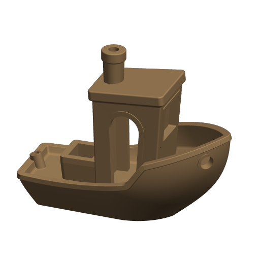 |

```bash
stl-render 3DBenchy.stl -o benchy.png --view print --material-color blue-grey --aa 4x
```

## Animated GIF

Generate a rotating animation of any model with the `--animate` flag:

| Rotating 3DBenchy |
|-------------------|
| 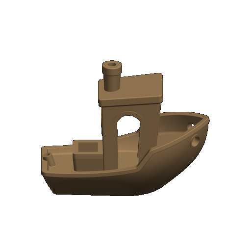 |

```bash
stl-render 3DBenchy.stl -o preview.gif --animate --material-color tan --aa 4x
```

The animation rotates around the Z axis (print bed orientation) at a fixed 25° elevation, producing a smooth 360° loop.

### Animation Options

| Option | Default | Description |
|--------|---------|-------------|
| `--animate` | (required) | Enable animated GIF output |
| `--frames` | 16 | Number of frames in the animation |
| `--frame-delay` | 100 | Milliseconds between frames |

```bash
# Quick preview (8 frames, fast)
stl-render model.stl -o preview.gif --animate --frames 8 --frame-delay 50

# Smooth animation (24 frames)
stl-render model.stl -o preview.gif --animate --frames 24

# Slow rotation (200ms per frame)
stl-render model.stl -o preview.gif --animate --frame-delay 200
```

Animation works with all other options:

```bash
stl-render model.stl -o preview.gif --animate \
    --material-color blue-grey \
    --lighting studio \
    --aa 4x \
    --width 512 \
    --height 512
```

## View Presets

### Print Bed View (`--view print`)

The `print` view is designed for 3D printing previews. It uses Z-up orientation so the model appears as it would on a print bed, with a slight tilt to show the top surface.

| Cube | Sphere | Cylinder |
|------|--------|----------|
|  |  | 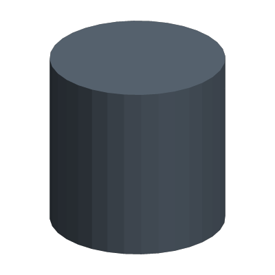 |

```bash
stl-render model.stl -o preview.png --view print --material-color tan
```

### View Comparison

| Front | Top | Isometric | Print |
|-------|-----|-----------|-------|
|  |  | 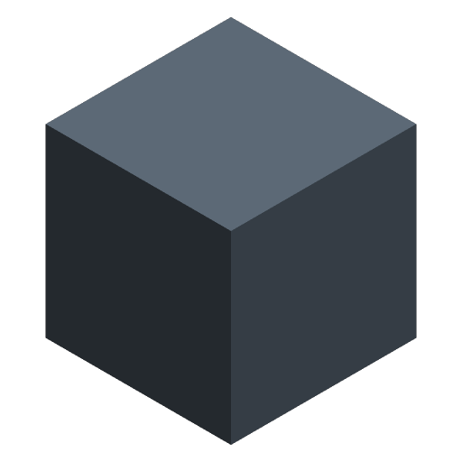 | 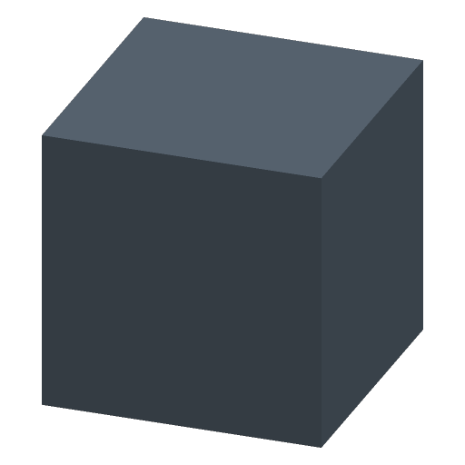 |

```bash
stl-render model.stl -o preview.png --view front
stl-render model.stl -o preview.png --view top
stl-render model.stl -o preview.png --view iso
stl-render model.stl -o preview.png --view print
```

**Standard presets (Y-up):** `front`, `back`, `left`, `right`, `top`, `bottom`, `iso`

**Print presets (Z-up):** `print`, `print-front`, `print-left`, `print-right`, `print-back`, `print-grid`

### Print View Angles

All print views maintain Z-up orientation (model appears as it would on a print bed):

| Front | Left | Right | Back |
|-------|------|-------|------|
| 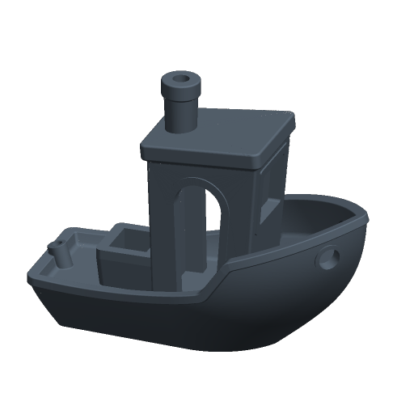 | 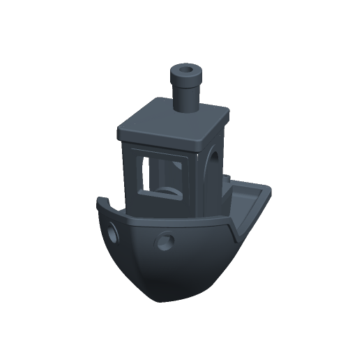 | 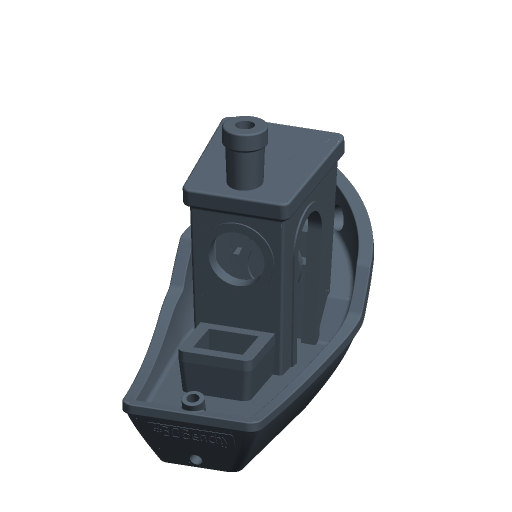 | 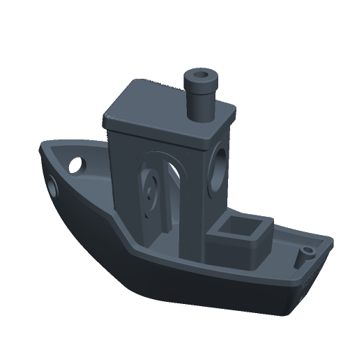 |

```bash
stl-render model.stl -o preview.png --view print-front
stl-render model.stl -o preview.png --view print-left
stl-render model.stl -o preview.png --view print-right
stl-render model.stl -o preview.png --view print-back
```

### Print Grid

Generate all four print angles in a single 2x2 grid image:

| Print Grid |
|------------|
| 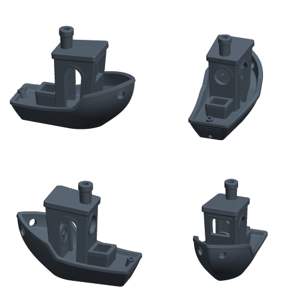 |

```bash
stl-render model.stl -o preview.png --view print-grid --width 1024 --height 1024
```

The grid layout is:
```
+---------------+---------------+
| print-front   | print-right   |
+---------------+---------------+
| print-back    | print-left    |
+---------------+---------------+
```

## Material Colors

Use `--material-color` with named presets or hex colors to match common filament colors:

| Blue Grey (`#708090`) | Tan (`#C19A6B`) |
|-----------------------|-----------------|
| 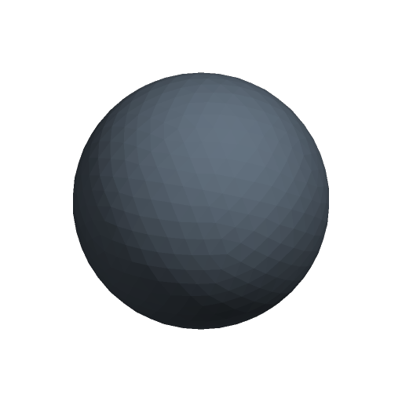 | 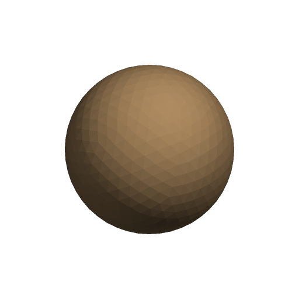 |

```bash
stl-render model.stl -o preview.png --material-color blue-grey  # Blue grey
stl-render model.stl -o preview.png --material-color tan        # Tan
stl-render model.stl -o preview.png --material-color "#ffcc00"  # Custom hex
```

Preset names are case insensitive. `grey` and `gray` are aliases.

| Preset | Hex |
|--------|-----|
| `tan` | `#C19A6B` |
| `blue-grey` | `#708090` |
| `white` | `#FFFFFF` |
| `black` | `#1A1A1A` |
| `red` | `#CC3333` |
| `orange` | `#FF6600` |
| `green` | `#339933` |
| `blue` | `#3366CC` |
| `grey` / `gray` | `#808080` |
| `silver` | `#C0C0C0` |

Examples for fixture previews:

```bash
stl-render fixtures/cube.stl -o cube-tan.png --view print --material-color tan
stl-render fixtures/sphere.stl -o sphere-silver.png --view iso --material-color silver
stl-render fixtures/cylinder.stl -o cylinder-orange.png --view print --material-color orange
```

## Lighting Presets

| Flat | Studio (default) | Technical |
|------|------------------|-----------|
| 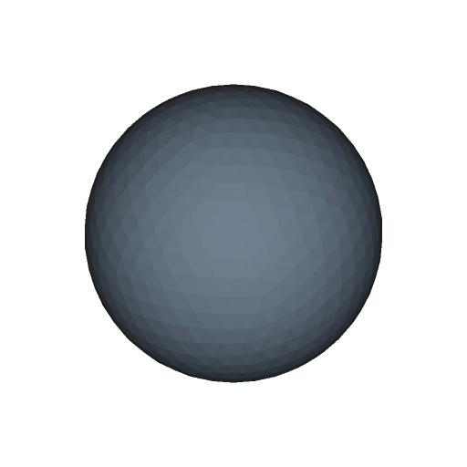 |  | 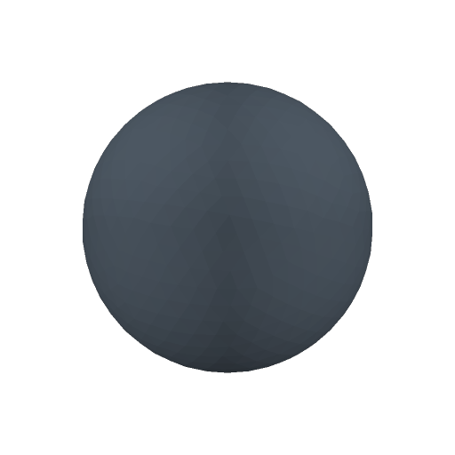 |

```bash
stl-render model.stl -o preview.png --lighting flat       # Single front light
stl-render model.stl -o preview.png --lighting studio     # Key + fill + rim (default)
stl-render model.stl -o preview.png --lighting technical  # Uniform multi-directional
```

- **Flat**: Single front-facing light. Good for technical drawings.
- **Studio**: Three-point lighting (key, fill, rim). Good for presentation renders.
- **Technical**: Even illumination from multiple directions. Good for inspection.

## Background Options

| Transparent (default) | Solid White | Solid Dark |
|-----------------------|-------------|------------|
| 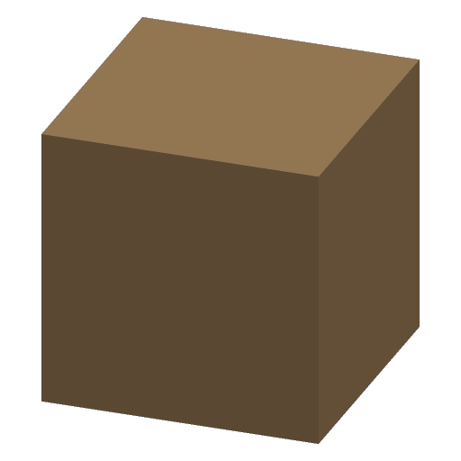 | 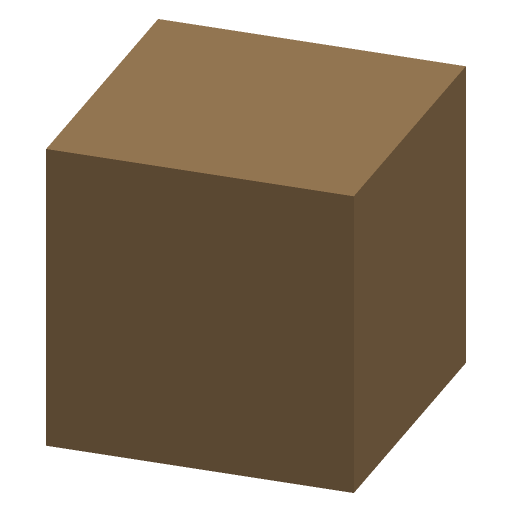 | 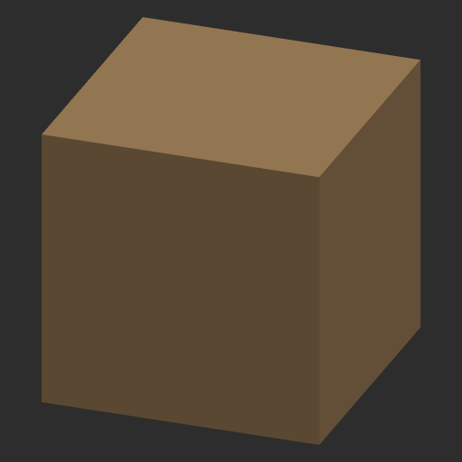 |

```bash
stl-render model.stl -o preview.png --background transparent
stl-render model.stl -o preview.png --background solid --background-color "#ffffff"
stl-render model.stl -o preview.png --background solid --background-color "#2d2d2d"
```

## Anti-Aliasing

Higher AA levels render at increased resolution then downsample for smoother edges.

| None | 2x (default) | 4x |
|------|--------------|-----|
|  | 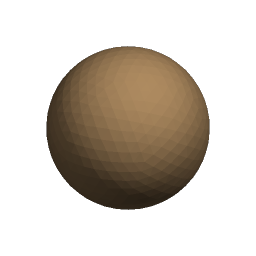 | 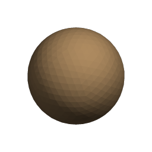 |

```bash
stl-render model.stl -o preview.png --aa none  # Fastest, aliased edges
stl-render model.stl -o preview.png --aa 2x    # Good quality (default)
stl-render model.stl -o preview.png --aa 4x    # Best quality, 4x render time
```

## Custom Camera Angles

For precise control, use `--azimuth` and `--elevation` instead of presets:

```bash
# Azimuth: rotation around vertical axis (0-360)
# Elevation: angle above horizon (-90 to 90)

stl-render model.stl -o preview.png --azimuth 45 --elevation 30
stl-render model.stl -o preview.png --azimuth 135 --elevation 15
```

## Image Size and Padding

```bash
# Custom dimensions
stl-render model.stl -o preview.png --width 1024 --height 768

# Adjust padding (space around model)
stl-render model.stl -o preview.png --padding 0.0   # No margin
stl-render model.stl -o preview.png --padding 0.2   # 20% margin
```

## Metadata Output

Export render information as JSON:

```bash
stl-render model.stl -o preview.png --metadata info.json
```

```json
{
  "input_file": "model.stl",
  "triangle_count": 12,
  "bounding_box": {
    "min": [-0.5, -0.5, -0.5],
    "max": [0.5, 0.5, 0.5]
  },
  "dimensions": [1.0, 1.0, 1.0]
}
```

## Batch Processing

### Multiple Files

Render multiple mesh files to a directory:

```bash
# Render all shell-expanded STL files to output directory
stl-render *.stl -o output/

# Output naming: model.stl -> output/model.png
```

Batch mode prints one concise status line per attempted conversion:

```text
Rendered fixtures/cube.stl as output/cube.png successful
Rendered fixtures/truncated.stl as output/truncated.png failed
```

### Recursive Directories

Render every supported mesh file under a directory tree:

```bash
stl-render models/ -o output/ --recursive
stl-render models/ -o output/ --recursive --views front,iso,print
```

Directory inputs include `.stl`, `.obj`, and `.3mf` files case-insensitively. Nested input paths are preserved under the output directory:

```text
models/cube.stl -> output/cube.png
models/parts/bracket.stl -> output/parts/bracket.png
models/parts/bracket.stl --views front,iso -> output/parts/bracket.front.png, output/parts/bracket.iso.png
```

If multiple source formats would otherwise write the same target, the source extension is kept in the output name:

```text
models/cube.stl -> output/cube.stl.png
models/cube.obj -> output/cube.obj.png
models/cube.3mf -> output/cube.3mf.png
```

### Multiple Views

Generate multiple views of a single model:

```bash
# Render front, back, and iso views
stl-render model.stl -o output/ --views front,back,iso

# Output naming: model.front.png, model.back.png, model.iso.png
```

### Multiple Files and Views

Combine both for comprehensive documentation:

```bash
# Render all print angles for multiple models
stl-render *.stl -o output/ --views print-front,print-left,print-right,print-back

# Output: model1.print-front.png, model1.print-left.png, ...
```

### Error Handling

By default, batch mode continues processing if one file fails:

```bash
# Continue on errors (default)
stl-render *.stl -o output/

# Abort on first error
stl-render *.stl -o output/ --strict
```

## Piping

```bash
# Read from stdin
cat model.stl | stl-render - -o preview.png

# Write to stdout
stl-render model.stl -o - > preview.png

# Full pipeline
cat model.stl | stl-render - -o - | convert - thumbnail.jpg
```

## Combining Options

```bash
# High-quality print preview with custom color
stl-render model.stl -o preview.png \
    --view print \
    --material-color blue-grey \
    --lighting studio \
    --aa 4x \
    --width 1024 \
    --height 1024

# Technical documentation render
stl-render model.stl -o preview.png \
    --view front \
    --material-color "#cccccc" \
    --lighting technical \
    --background solid \
    --background-color "#ffffff"

# Print grid for product listing
stl-render model.stl -o grid.png \
    --view print-grid \
    --material-color tan \
    --aa 4x \
    --width 1024 \
    --height 1024

# Batch render all angles for documentation
stl-render model.stl -o docs/ \
    --views front,back,left,right,top,print \
    --material-color blue-grey \
    --aa 2x
```
