# stl-render Examples

A feature-by-feature reference, ordered from the simplest invocation to advanced
workflows. Each section shows what an option does and how to use it.

## Quick Start

Render a mesh to PNG with the defaults (iso view, 512×512, transparent background):

```bash
stl-render model.stl -o preview.png
```

## Supported Formats

STL (binary and ASCII), OBJ, and 3MF are auto-detected from file **content**, not
the extension. All formats produce identical renders for the same geometry.

| STL (binary/ASCII) | OBJ (text) | 3MF (ZIP/XML) |
|--------------------|------------|---------------|
|  |  | 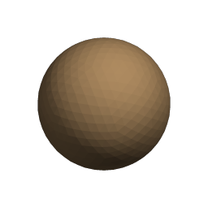 |

```bash
stl-render model.stl -o preview.png  # Binary or ASCII STL
stl-render model.obj -o preview.png  # Wavefront OBJ
stl-render model.3mf -o preview.png  # 3MF package
```

3MF files also carry multi-object scenes, assemblies, and embedded colors — see
[3MF Scenes & Colors](#3mf-scenes--colors).

## View Presets

Pick the camera angle. Standard presets are Y-up; `print` presets are Z-up so the
model sits as it would on a print bed, tilted slightly to show the top surface.

| Cube (print) | Sphere (print) | Cylinder (print) |
|------|--------|----------|
|  |  | 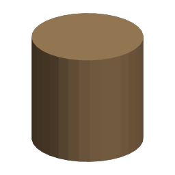 |

| Front | Top | Isometric | Print |
|-------|-----|-----------|-------|
|  | 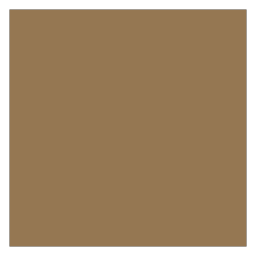 | 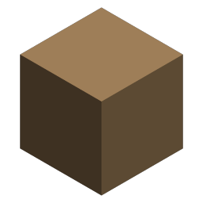 |  |

```bash
stl-render model.stl -o preview.png --view iso     # default
stl-render model.stl -o preview.png --view front
stl-render model.stl -o preview.png --view print --material-color tan
```

**Standard presets (Y-up):** `front`, `back`, `left`, `right`, `top`, `bottom`, `iso`

**Print presets (Z-up):** `print`, `print-front`, `print-left`, `print-right`, `print-back`, `print-grid`

### Print Angles

| Front | Left | Right | Back |
|-------|------|-------|------|
|  |  | 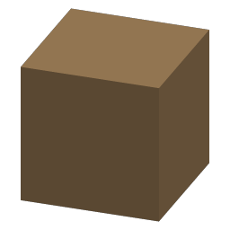 |  |

```bash
stl-render model.stl -o preview.png --view print-front
stl-render model.stl -o preview.png --view print-back
```

### Print Grid

`print-grid` renders all four print angles into a single 2×2 image — handy for
product listings:

| Print Grid |
|------------|
| 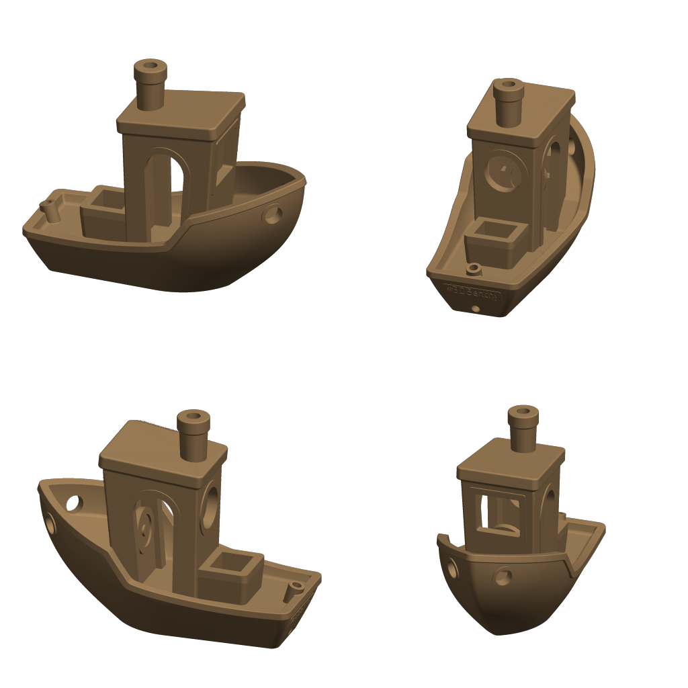 |

```bash
stl-render model.stl -o preview.png --view print-grid --width 1024 --height 1024
```

```
+---------------+---------------+
| print-front   | print-right   |
+---------------+---------------+
| print-back    | print-left    |
+---------------+---------------+
```

## Material Colors

Set the surface color with a named filament preset or any 6-digit hex value.
Preset names are case-insensitive; `grey` and `gray` are aliases.

| Blue Grey (`#708090`) | Tan (`#C19A6B`) |
|-----------------------|-----------------|
| 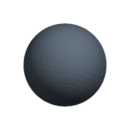 | 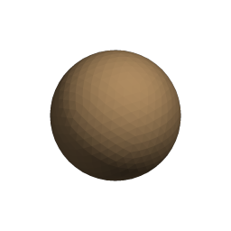 |

```bash
stl-render model.stl -o preview.png --material-color blue-grey
stl-render model.stl -o preview.png --material-color tan
stl-render model.stl -o preview.png --material-color "#ffcc00"  # custom hex
```

| Preset | Hex | | Preset | Hex |
|--------|-----|-|--------|-----|
| `tan` | `#C19A6B` | | `orange` | `#FF6600` |
| `blue-grey` | `#708090` | | `green` | `#339933` |
| `white` | `#FFFFFF` | | `blue` | `#3366CC` |
| `black` | `#1A1A1A` | | `grey` / `gray` | `#808080` |
| `red` | `#CC3333` | | `silver` | `#C0C0C0` |

## Lighting Presets

Control how surfaces are shaded.

| Flat | Studio (default) | Technical |
|------|------------------|-----------|
| 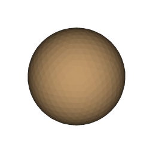 |  | 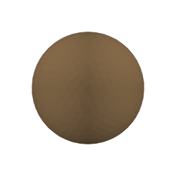 |

```bash
stl-render model.stl -o preview.png --lighting flat       # Single front light — technical drawings
stl-render model.stl -o preview.png --lighting studio     # Key + fill + rim (default) — presentation
stl-render model.stl -o preview.png --lighting technical  # Uniform multi-directional — inspection
```

## Background Options

Transparent by default; switch to a solid fill with any hex color.

| Transparent (default) | Solid White | Solid Dark |
|-----------------------|-------------|------------|
|  | 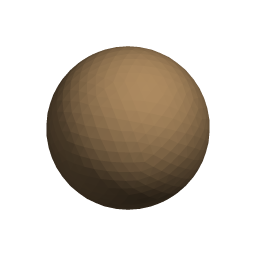 | 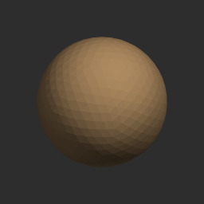 |

```bash
stl-render model.stl -o preview.png --background transparent
stl-render model.stl -o preview.png --background solid --background-color "#ffffff"
stl-render model.stl -o preview.png --background solid --background-color "#2d2d2d"
```

## Anti-Aliasing

Supersample at 2× (default) or 4× resolution, then downsample for smoother edges.

| None | 2x (default) | 4x |
|------|--------------|-----|
|  | 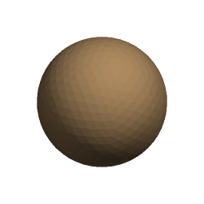 |  |

```bash
stl-render model.stl -o preview.png --aa none  # Fastest, aliased edges
stl-render model.stl -o preview.png --aa 2x    # Good quality (default)
stl-render model.stl -o preview.png --aa 4x    # Best quality, ~4x render time
```

## Image Size & Padding

```bash
# Output dimensions
stl-render model.stl -o preview.png --width 1024 --height 768

# Padding (space around the model; default 0.08)
stl-render model.stl -o preview.png --padding 0.0   # No margin
stl-render model.stl -o preview.png --padding 0.2   # 20% margin
```

## Custom Camera Angles

When the presets don't fit, drive the camera directly with `--azimuth` (rotation
around the vertical axis, 0–360) and `--elevation` (angle above the horizon,
-90 to 90):

```bash
stl-render model.stl -o preview.png --azimuth 45 --elevation 30
stl-render model.stl -o preview.png --azimuth 135 --elevation 15
```

## Animated GIF

`--animate` renders a smooth 360° rotation around the Z axis (print-bed
orientation) at a fixed 25° elevation. A bounding-sphere fit keeps the model the
same size in every frame.

| Rotating 3DBenchy |
|-------------------|
|  |

```bash
stl-render model.stl -o preview.gif --animate --material-color tan --aa 4x
```

| Option | Default | Description |
|--------|---------|-------------|
| `--animate` | — | Enable animated GIF output |
| `--frames` | 16 | Number of frames in the rotation |
| `--frame-delay` | 100 | Milliseconds between frames |

```bash
stl-render model.stl -o preview.gif --animate --frames 8 --frame-delay 50    # quick preview
stl-render model.stl -o preview.gif --animate --frames 24                     # smoother
stl-render model.stl -o preview.gif --animate --frame-delay 200               # slow rotation
```

> All frames are held in memory before encoding, so peak memory grows with
> `--frames` × output size. Reduce either for very long, high-resolution loops.

## Dimension Overlay

`--dimensions` overlays a depth-aware bounding box with X/Y/Z extents — useful for
reading print size at a glance. Rear box edges are hidden by the model and near
edges drawn over it, so the box appears to wrap around the part. Colors are
auto-chosen for contrast against the render.

| Millimeters (default) | Inches |
|-----------------------|--------|
|  | 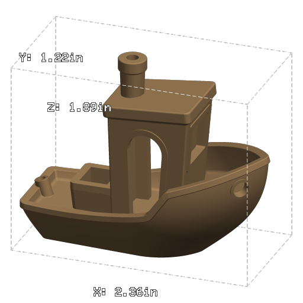 |

```bash
stl-render model.stl -o preview.png --dimensions                          # mm (default)
stl-render model.stl -o preview.png --dimensions --units in               # inches
stl-render model.stl -o preview.png --dimensions --dimension-color "#ff0000"
```

It works with animations too (label edges are fixed on frame 0 so they don't jump):

| Rotating with Dimensions |
|--------------------------|
| 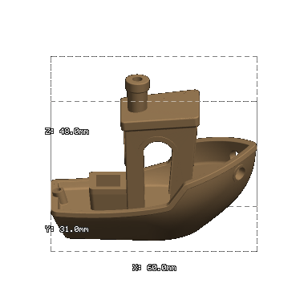 |

```bash
stl-render model.stl -o preview.gif --animate --frames 24 --frame-delay 150 --dimensions
```

## Watermark

`--watermark` composites a logo (PNG with alpha) onto the output for consistent
branding. It is scaled relative to the output width, inset by a margin, and
alpha-blended so transparent regions of the logo show the render beneath.

| Logo (PNG with alpha) | Watermarked Render |
|-----------------------|--------------------|
|  | 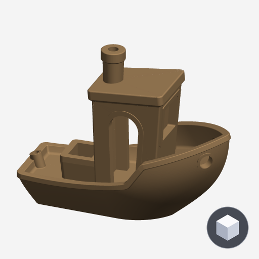 |

```bash
stl-render model.stl -o preview.png --watermark logo.png                  # bottom-right, 15%, opaque
stl-render model.stl -o preview.png --watermark logo.png --watermark-opacity 50
stl-render model.stl -o preview.png --watermark logo.png \
    --watermark-position top-left --watermark-scale 18 --watermark-margin 16
```

| Option | Default | Description |
|--------|---------|-------------|
| `--watermark` | (none) | Path to watermark image (PNG with alpha) |
| `--watermark-position` | `bottom-right` | `top-left`, `top-right`, `bottom-left`, `bottom-right`, `center` |
| `--watermark-opacity` | `100` | Opacity percentage (0–100) |
| `--watermark-scale` | `15` | Watermark width as a percent of output width |
| `--watermark-margin` | `10` | Inset from the edges, in pixels |

The watermark applies to every output mode — each GIF frame, the print-grid
composite (once), and all files in a batch:

```bash
stl-render model.stl -o preview.gif --animate --frames 24 --watermark logo.png
stl-render model.stl -o grid.png --view print-grid --watermark logo.png
stl-render *.stl -o output/ --watermark logo.png
```

A missing or undecodable watermark file is an error; invalid position, opacity,
or scale values are rejected as usage errors.

## 3MF Scenes & Colors

3MF packages can describe whole scenes and carry embedded colors — both render
automatically with no extra flags.

### Multi-Object Scenes & Assemblies

| Multi-Object | Assembly with Components |
|--------------|--------------------------|
| 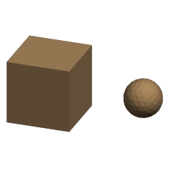 | 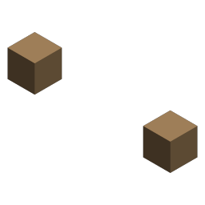 |

```bash
stl-render multi_object.3mf -o preview.png --view print   # all objects, correctly positioned
stl-render assembly.3mf -o preview.png --view iso         # components with nested transforms
```

Supported: build items with transform matrices, component references with nested
transforms, and unit metadata (mm, cm, inch, foot, micron).

### Embedded Colors

Colorgroups (per-face and per-vertex colors) render by default:

| Colored Cube (static) | Colored Cube (animated) |
|-----------------------|-------------------------|
| 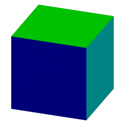 | 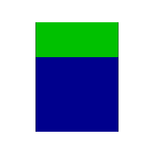 |

```bash
# Embedded colors (default)
stl-render colored_model.3mf -o preview.png

# Ignore embedded colors, use a uniform material color
stl-render colored_model.3mf -o preview.png --force-color --material-color tan

# Inspect the palette (index → hex), then exit
stl-render model.3mf -o /dev/null --list-colors
```

```text
  0: #ff0000 (alpha: 255)
  1: #00ff00 (alpha: 255)
  2: #0000ff (alpha: 255)
  ...
```

### Overriding Palette Colors

`--color-map` recolors palette entries by index (indices match `--list-colors`)
without editing the file. Each override replaces that color wherever it appears.

| Embedded Colors | Remapped with `--color-map` |
|-----------------|------------------------------|
| 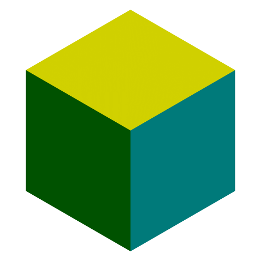 |  |

```bash
stl-render colored_cube.3mf -o preview.png --view iso \
  --color-map "0:#ffffff,1:#ff8800,2:#8800ff,3:#00aaff,4:#ffdd00,5:#ff0066"
```

Out-of-range indices are ignored, and overrides have no effect under
`--force-color` (which discards embedded colors entirely).

## Metadata Output

`--metadata` writes a JSON sidecar with the triangle count, bounding box, and
dimensions — useful for indexing or downstream tooling:

```bash
stl-render model.stl -o preview.png --metadata info.json
```

```json
{
  "input_file": "model.stl",
  "triangle_count": 12,
  "bounding_box": { "min": [-0.5, -0.5, -0.5], "max": [0.5, 0.5, 0.5] },
  "dimensions": [1.0, 1.0, 1.0]
}
```

## Batch Processing

Pass multiple files (or a directory) and an output directory to render in bulk.

```bash
# Shell-expanded files → output directory (model.stl -> output/model.png)
stl-render *.stl -o output/
```

Batch mode prints one status line per file:

```text
Rendered fixtures/cube.stl as output/cube.png successful
Rendered fixtures/truncated.stl as output/truncated.png failed
```

### Recursive Directories

```bash
stl-render models/ -o output/ --recursive
stl-render models/ -o output/ --recursive --view front,iso,print
```

Directory inputs include `.stl`, `.obj`, and `.3mf` (case-insensitive), and
nested paths are preserved under the output directory:

```text
models/cube.stl              -> output/cube.png
models/parts/bracket.stl     -> output/parts/bracket.png
```

If different source formats would collide on one target, the source extension is
kept in the output name:

```text
models/cube.stl -> output/cube.stl.png
models/cube.obj -> output/cube.obj.png
```

### Multiple Views

Render several views of each model in one run (suffixed by view name):

```bash
stl-render model.stl -o output/ --view front,back,iso
# -> model.front.png, model.back.png, model.iso.png

stl-render *.stl -o output/ --view print-front,print-left,print-right,print-back
```

### Error Handling

Batch mode continues past failures by default and exits with the worst error
code; `--strict` aborts on the first error.

```bash
stl-render *.stl -o output/            # continue on errors (default)
stl-render *.stl -o output/ --strict   # abort on first error
```

## Piping

Use `-` for stdin/stdout to compose with other tools:

```bash
cat model.stl | stl-render - -o preview.png          # read from stdin
stl-render model.stl -o - > preview.png              # write to stdout
cat model.stl | stl-render - -o - | convert - thumbnail.jpg
```

## Combining Options

```bash
# High-quality print preview with custom color
stl-render model.stl -o preview.png \
    --view print --material-color blue-grey --lighting studio \
    --aa 4x --width 1024 --height 1024

# Technical documentation render
stl-render model.stl -o preview.png \
    --view front --material-color "#cccccc" --lighting technical \
    --background solid --background-color "#ffffff"

# Branded preview for sharing
stl-render model.stl -o preview.png \
    --view print --material-color tan --aa 4x \
    --background solid --background-color "#f4f4f4" \
    --watermark logo.png --watermark-position bottom-right --watermark-scale 18

# Batch all angles for documentation
stl-render model.stl -o docs/ \
    --view front,back,left,right,top,print \
    --material-color blue-grey --aa 2x
```

## Gallery: 3DBenchy

[3DBenchy](https://www.3dbenchy.com) is the public-domain 3D-printing benchmark
model (~225K triangles), shown here to demonstrate stl-render on a real part.

| Blue Grey | Tan |
|-----------|-----|
| 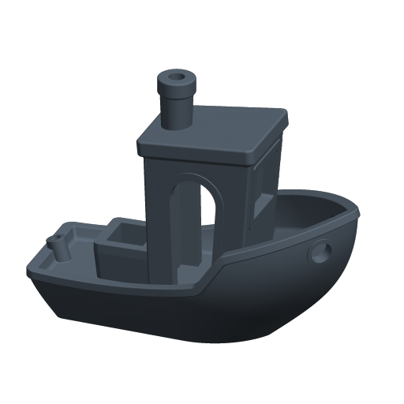 | 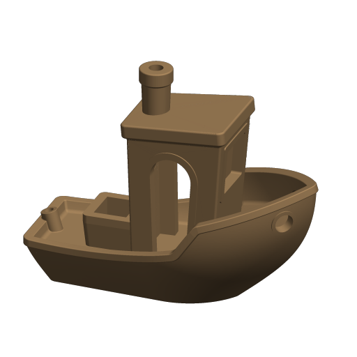 |

```bash
stl-render 3DBenchy.stl -o benchy.png --view print --material-color blue-grey --aa 4x
```
